# 🌟 StoryNest

**StoryNest** is an AI-powered storytelling platform that creates personalized stories and illustrations for kids.  
It combines a **FastAPI (Python 3.11)** backend orchestrated through **LangGraph** and a **React + TypeScript** frontend for a seamless, interactive user experience.

---

## 🧩 Tech Stack

| Layer | Technology |
|-------|-------------|
| **Frontend** | React + TypeScript |
| **Backend** | FastAPI, Uvicorn |
| **AI & Orchestration** | LangGraph, LangChain, OpenAI API |
| **Database** | LanceDB |
| **Auth & Security** | PyJWT / Python-JOSE |
| **Media** | gTTS, Pillow |
| **Environment** | python-dotenv |

---

## ⚙️ Backend Setup (Python 3.11)

### 1️⃣ Prerequisites
- Python **3.11.x**
- pip (comes with Python)
- Optional: [Graphviz](https://graphviz.gitlab.io/download/) (if you want to generate architecture diagrams)

---

### 2️⃣ Create & Activate Virtual Environment

```bash
# Navigate to project root
cd StoryNest

# Create virtual environment
python -m venv .storynest

# Activate (Windows)
.storynest\Scripts\activate

# Activate (Linux/macOS)
source .storynest/bin/activate
```

You’ll see your environment name like:
```
(.storynest) PS D:\Outskill\StoryNest>
```

---

### 3️⃣ Install Dependencies

Use the cleaned `requirements.txt` (ensure it does **not** include `logging`).

```bash
pip install --upgrade pip setuptools wheel
pip install -r requirements.txt
```

✅ If you see any build issues (for example with `lancedb` on Windows), try:
```bash
pip install --no-cache-dir -r requirements.txt
```

---

### 4️⃣ Configure Environment Variables

Create a `.env` file in your project root:

```env
OPENAI_API_KEY=your_openai_api_key_here
OPENAI_MODEL=gpt-4o-mini
OPENAI_TEMPERATURE=0.8
OPENAI_MAX_TOKENS=5000
```

> ⚠️ Never commit `.env` or `.encryption.key` files to GitHub.

---

### 5️⃣ Run the API Server

Make sure you’re in the same folder where `api_server.py` exists.

```bash
# Preferred (universal)
python -m uvicorn api_server:app --reload
```

If your API file lives under a subfolder (like `/backend/api_server.py`):

```bash
python -m uvicorn backend.api_server:app --reload
```

✅ You should see:
```
Uvicorn running on http://127.0.0.1:8000 (Press CTRL+C to quit)
```

Now visit:  
👉 http://127.0.0.1:8000/docs — FastAPI interactive Swagger UI

---

## 💻 Frontend Setup (React + TypeScript)

### 1️⃣ Navigate to Frontend Folder
```bash
cd frontend
```

### 2️⃣ Install Dependencies
```bash
# Using npm
npm install
# or yarn
yarn install
```

### 3️⃣ Create Frontend Environment File (optional)
Create `frontend/.env` if needed:

```env
VITE_API_BASE_URL=http://localhost:8000
```

### 4️⃣ Run Frontend Server
```bash
npm start
```

The UI will be available at:  
👉 http://localhost:3000

---

## 🔗 How Backend & Frontend Connect

1. The frontend sends requests to FastAPI endpoints:
   - `/api/auth/login` — login and token handling  
   - `/api/stream-story` — AI-generated story (LangGraph pipeline)  
   - `/api/generate-images` — optional image generation  
2. Backend orchestrates nodes:
   - `langgraph_client.py` → `workflow_nodes.py` → `message_bus.py`
3. Output (text + images) streams back to the frontend in real time.

---

## 🧠 Developer Docs

| File | Description |
|------|--------------|
| `docs/architecture.md` | High-level architecture diagram |
| `docs/flow.md` | End-to-end LangGraph flow |
| `requirements.txt` | Python dependencies |
| `frontend/package.json` | UI dependencies |

---

## 🧰 Common Commands

| Task | Command |
|------|----------|
| Check Python version | `python --version` |
| Freeze dependencies | `pip freeze > requirements.txt` |
| Install dependencies | `pip install -r requirements.txt` |
| Run backend | `python -m uvicorn api_server:app --reload` |
| Run frontend | `npm run dev` |
| Format Python code | `black .` |
| Check installed packages | `pip list` |

---

## ⚡ Troubleshooting

| Problem | Fix |
|----------|-----|
| `uvicorn not recognized` | Activate `.storynest` and run `pip install uvicorn` |
| `logging SyntaxError during install` | Remove `logging==0.4.9.6` from requirements |
| `ModuleNotFoundError: fastapi` | Install deps with `pip install -r requirements.txt` |
| Frontend not connecting to backend | Verify `VITE_API_BASE_URL` in `.env` |
| LanceDB build error on Windows | `pip install lancedb --prefer-binary` |

---

## 🐳 Optional: Docker Run

```dockerfile
FROM python:3.11
WORKDIR /app
COPY requirements.txt .
RUN pip install -r requirements.txt
COPY . .
CMD ["uvicorn", "api_server:app", "--host", "0.0.0.0", "--port", "8000"]
```

Build and run:

```bash
docker build -t storynest-backend .
docker run -p 8000:8000 storynest-backend
```

---

## 🧾 License
MIT License © 2025 Preetam Chauhan


## 🎬 StoryNest Demo Video
[](https://www.youtube.com/watch?v=NjWFSBPrhEE)


## 🖼️ Screenshots

> The app supports **multiple languages** (see the language menu), light and dark themes, and audio narration.

### 🔐 Login
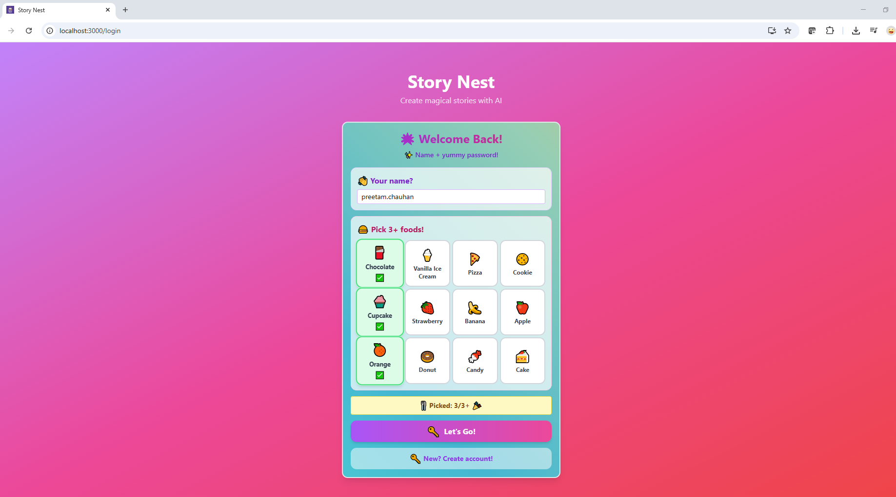

### 🧭 Create Your Magical Story (Home)
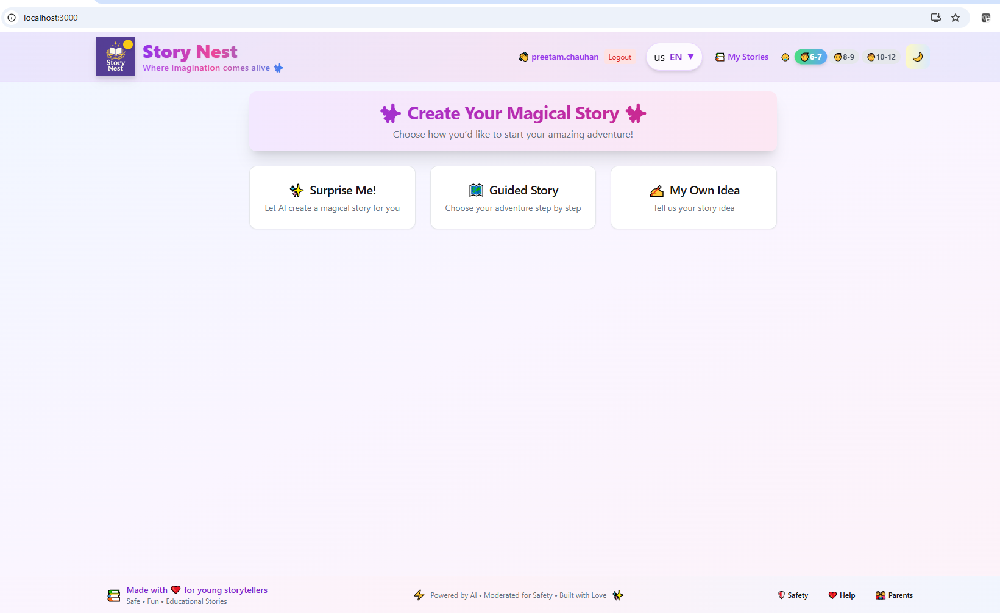

### 🌍 Language Selection (Multi-language support)
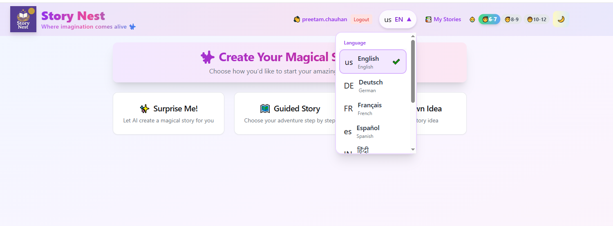

### 🌙 Dark Mode
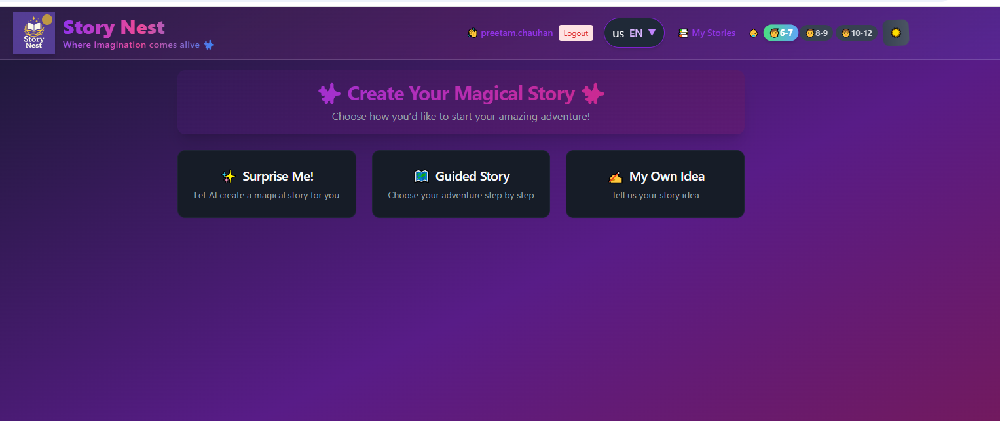

### 🎲 Surprise Me! (Start)
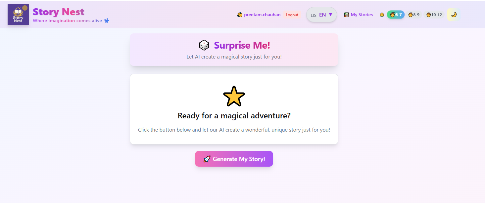

### ⚙️ Generation Progress (LangGraph pipeline)
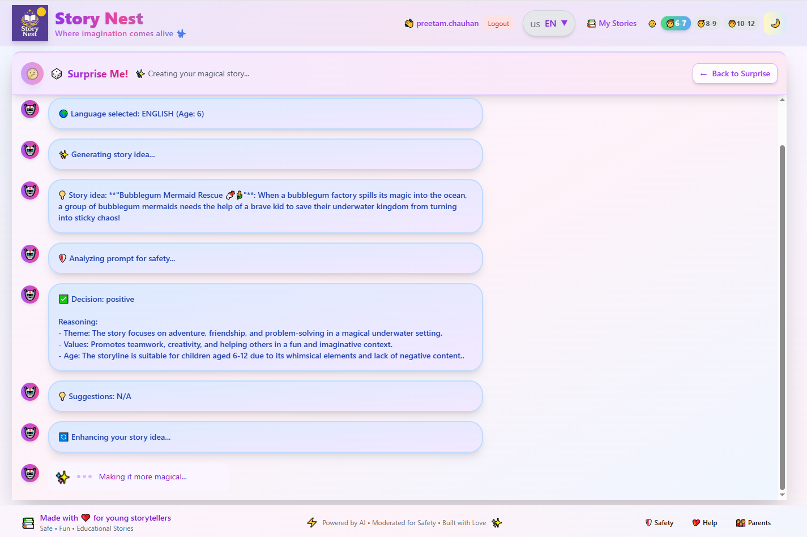

### 📖 Story Viewer (Modal)
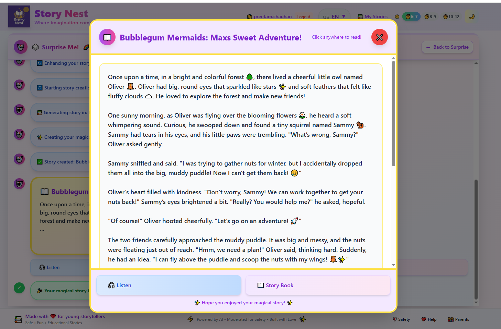

### 🎵 Creating Audio Narration
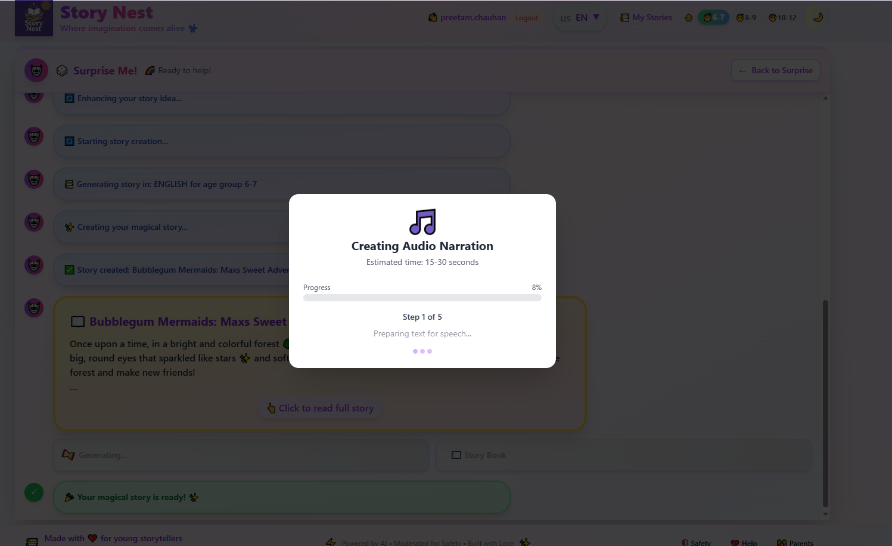

### 🎧 Audio Player
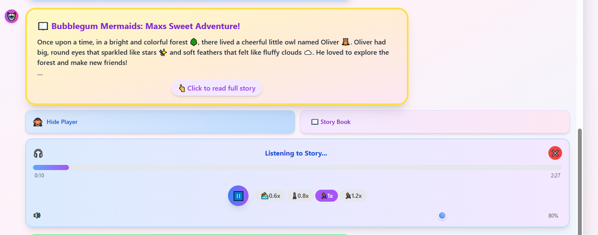

### 📝 Guided Story Form


### 📚 My Stories — Library, Storybook, and Playback

The **My Stories** section lets kids browse saved stories, open a **storybook** view with illustrated pages, and use the **audio player** to listen. It also showcases **multi-language** content (e.g., Arabic UI, French and Japanese storybooks).

- **Arabic UI - Create Story (RTL support):**  
  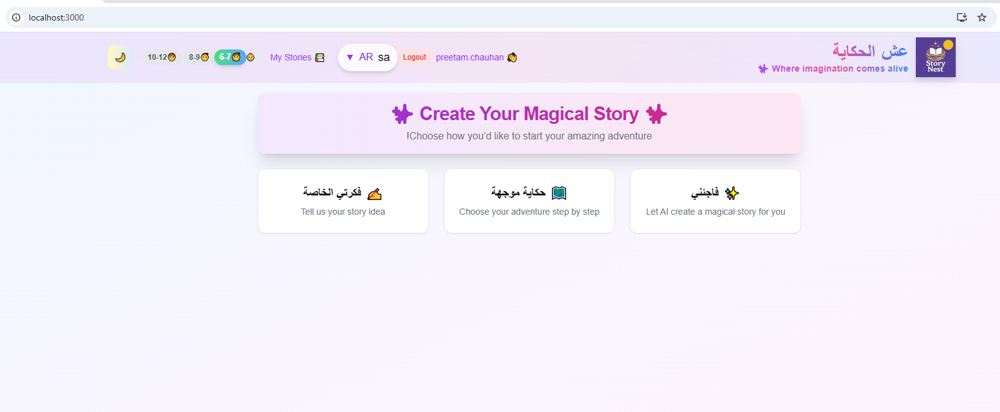

- **My Stories — grid of saved stories (page 1):**  
  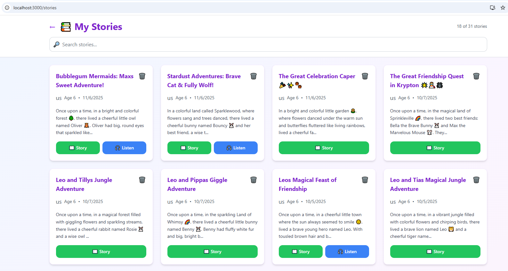

- **My Stories — more saved stories, multiple languages:**  
  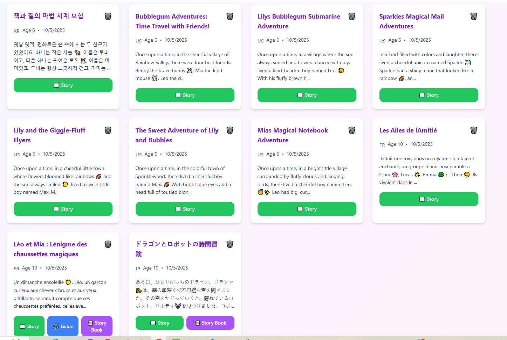

- **Story Book — French example:**  
  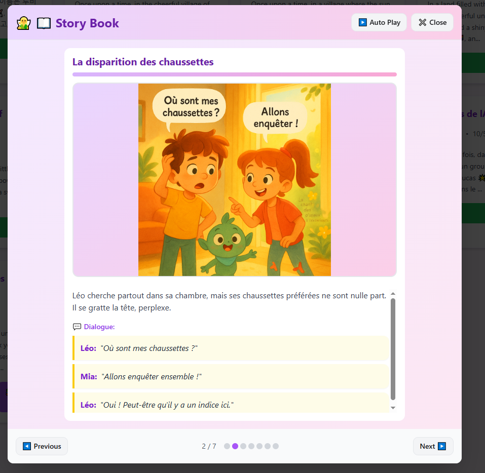

- **Story Book — Japanese example:**  
  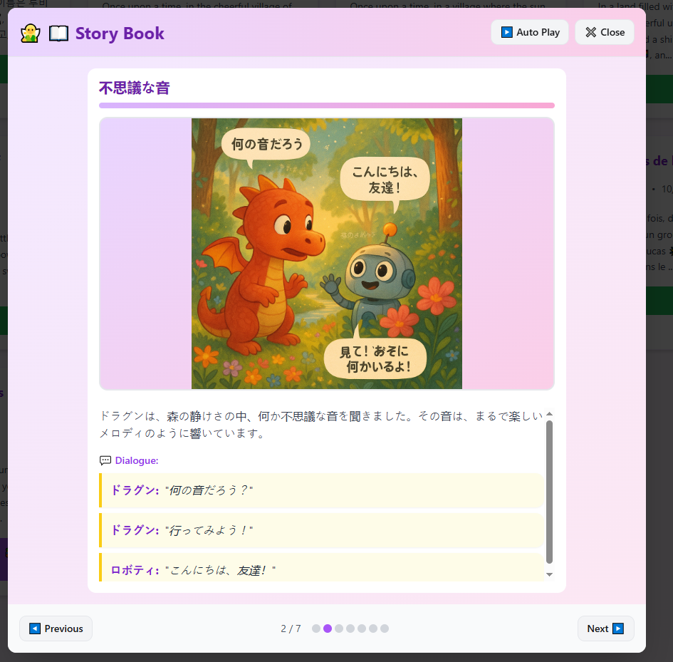

- **My Stories — audio player bar:**  
  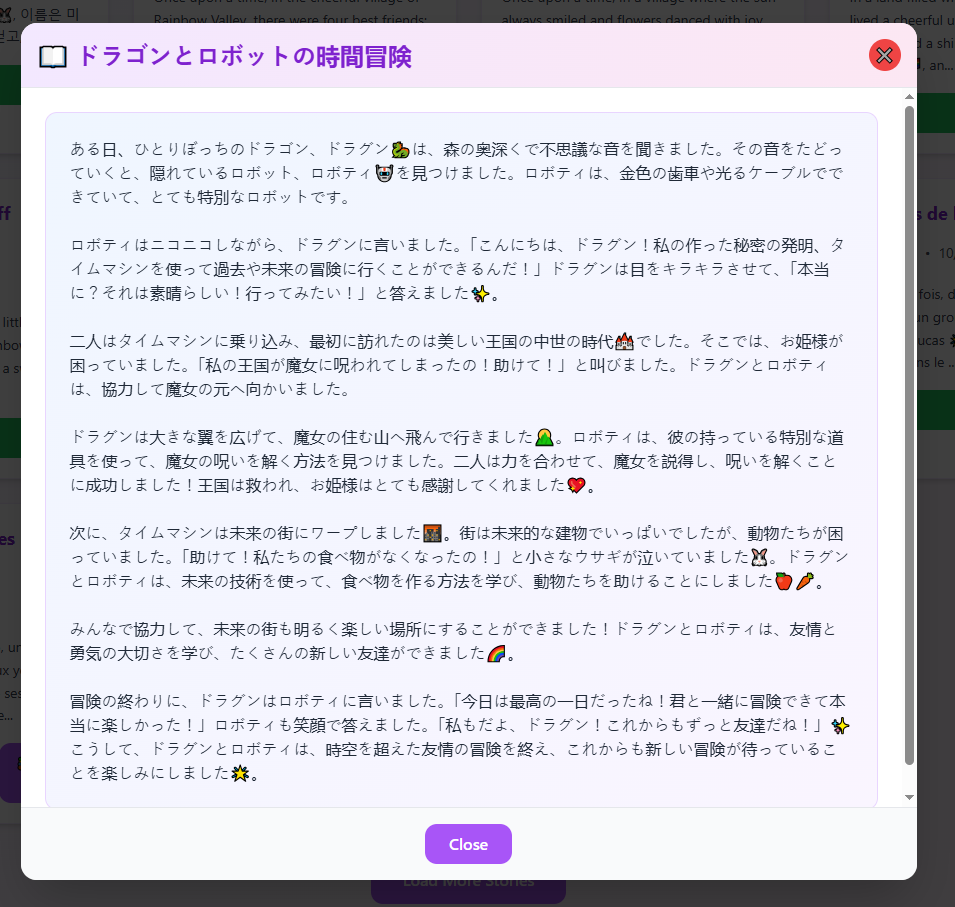

- **My Stories — player overlay active:**  
  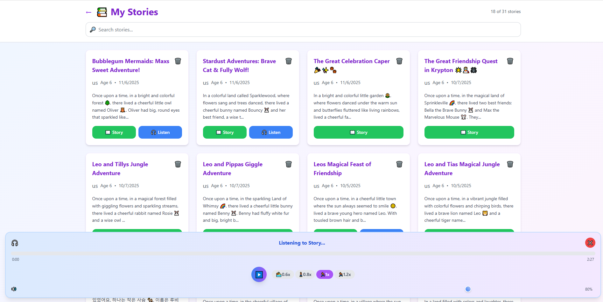
  
  
### 📚 StoryNest - Api's

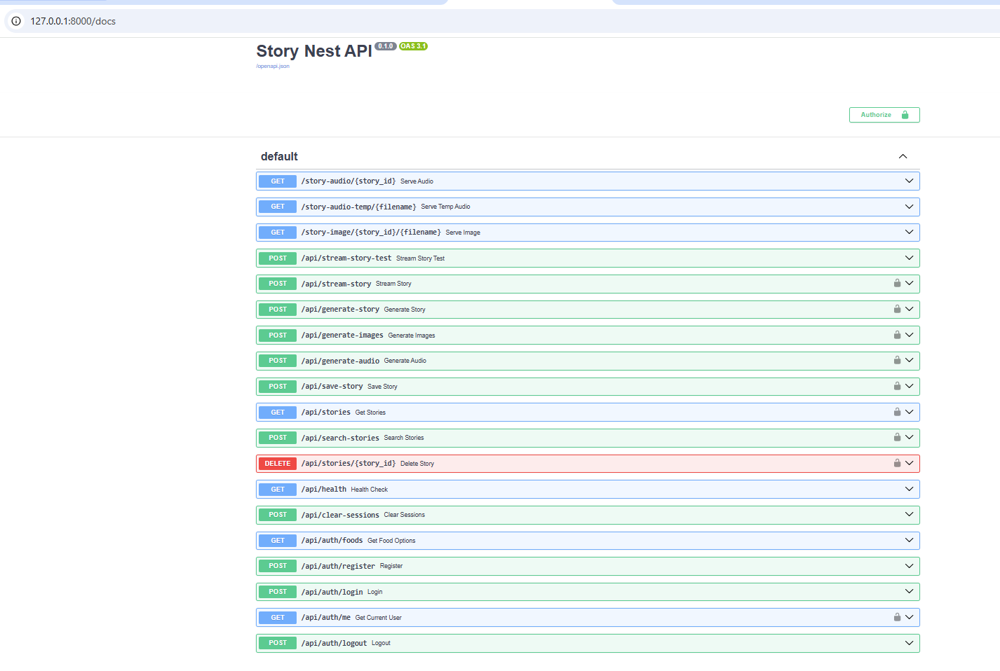
