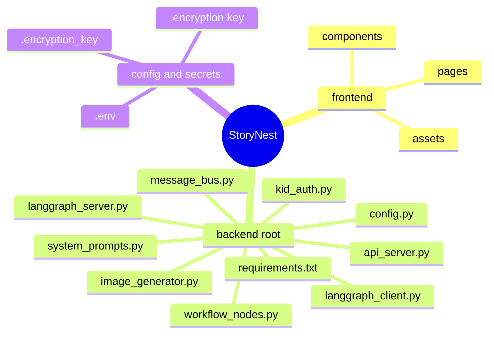
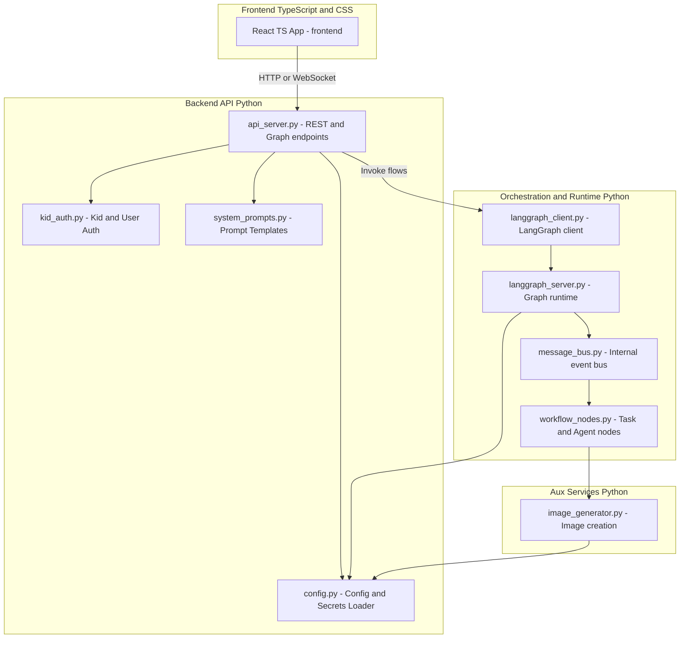
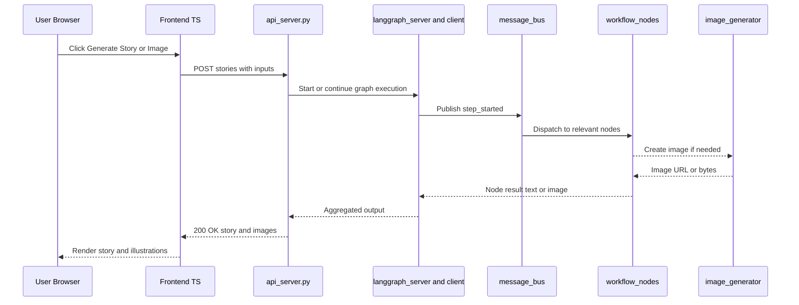
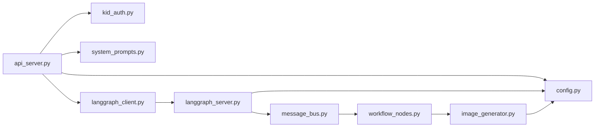

# StoryNest — Architecture Overview

This document provides a high-level view of the project structure and data flow. All diagrams are Mermaid-ready for common renderers (VS Code, GitHub).

---

## 1) Repository Map (condensed)

> Tip: ensure any real secrets are not committed; use environment variables and .gitignore for local keys.

---

## 2) System Architecture

---

## 3) Request Lifecycle

---

## 4) Python Modules Overview

