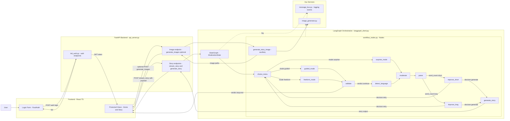
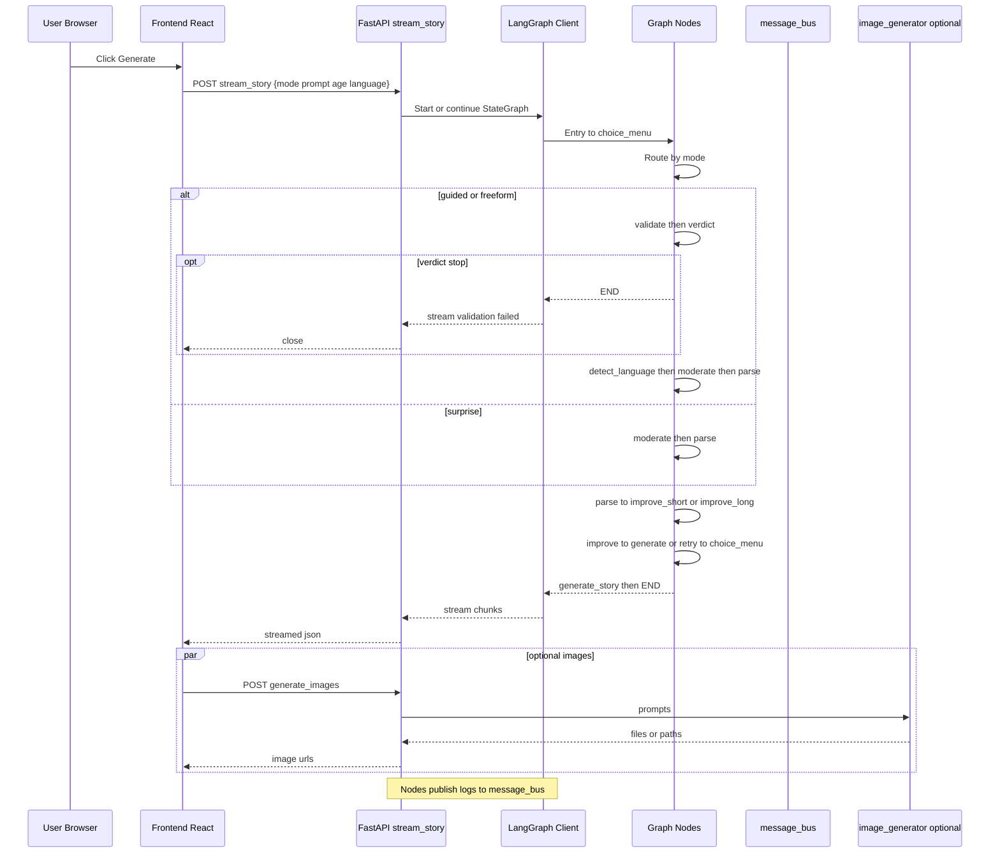

# StoryNest — End-to-End Flow (VS Code friendly)

Below are minimal-safe Mermaid blocks tested for stricter parsers (one edge per line, simple labels, and two-participant notes).

---

## 1) Flowchart (Mermaid ultra-safe)

---

## 2) Sequence — Streaming story (UI to API to LangGraph)

